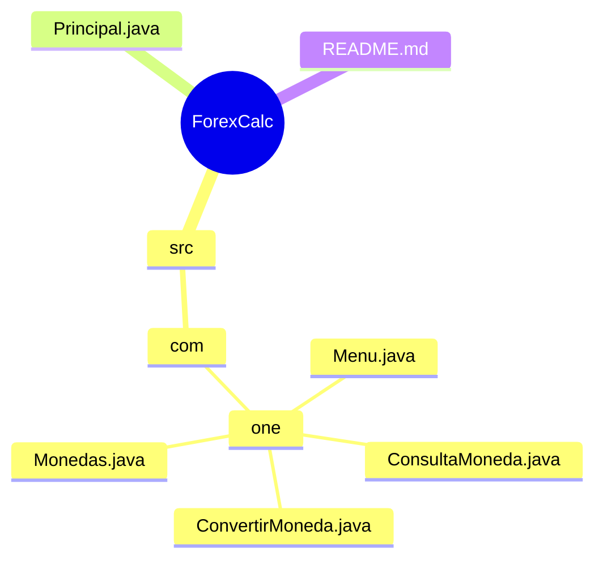

# 💱 ForexCalc

**ForexCalc** es una aplicación Java de escritorio que permite realizar conversiones de moneda en tiempo real utilizando datos actualizados desde la [ExchangeRate-API](https://www.exchangerate-api.com/). La interfaz basada en `JOptionPane` permite al usuario operar de forma simple, sin necesidad de una consola o interfaz gráfica compleja.

---

## 🧩 Estructura del proyecto

El proyecto está organizado en las siguientes clases:

- `Principal.java`: Clase principal que inicia la aplicación.
- `Menu.java`: Muestra el menú de opciones al usuario.
- `ConvertirMoneda.java`: Contiene la lógica de conversión.
- `ConsultaMoneda.java`: Se encarga de consultar los datos desde la API.
- `Monedas.java`: Un record de Java que representa la respuesta de la API con los datos necesarios para la conversión.

## 🖼 Ejemplo de uso

Al ejecutar la aplicación, el usuario verá un menú como el siguiente:

Seleccione la moneda a convertir:
1. Dólar a Peso argentino
2. Dólar a Peso colombiano
3. Dólar a Real Brasileño
...
7. Otra conversión

Luego se solicita un monto, se consulta la API y se muestra el resultado convertido.

---
## 📂 Estructura de archivos




## 🛠 Tecnologías utilizadas

- Java (recomendado JDK 17 o superior)
- `javax.swing.JOptionPane` para interacción visual básica
- `HttpURLConnection` para peticiones a la API
- [ExchangeRate-API](https://www.exchangerate-api.com/) para obtener tasas de cambio actualizadas

---

## 🚀 Funcionalidades

- Menú con 6 conversiones de divisas comunes.
- Opción de conversión alternativa para monedas personalizadas.
- Interfaz amigable mediante cuadros de diálogo.
- Conversión precisa con datos obtenidos en tiempo real desde la API.
- Validación de entradas del usuario.

---

## ▶️ Ejecución del proyecto

1. Clona el repositorio o descarga los archivos `.java`.

2. Asegúrate de tener configurado un entorno con JDK 17 o superior.

3. Abre el proyecto en **IntelliJ IDEA** (o tu IDE favorito) y ejecuta `Principal.java`.

   Si prefieres la terminal, compila y ejecuta así:

   ```bash
   javac -d out src/com/one/*.java src/Principal.java
   java -cp out Principal

## 📃 Licencia
Este proyecto está licenciado bajo la MIT License. Puedes utilizar, modificar y redistribuir libremente.

## 🤝 Contribuciones
¡Las contribuciones son bienvenidas! Puedes hacer un fork del repositorio, crear una rama y enviar un Pull Request.

## ✉️ Contacto
Si tienes preguntas o sugerencias, puedes escribirme a: [peterxmen3@gmail.com]
